# 🧠 DualStreamNet: Multimodal Deep Learning for Diabetic Retinopathy Detection

---

## 🔍 Overview

**Diabetic Retinopathy (DR)** is a major cause of preventable blindness worldwide, progressing silently until advanced stages.  
This project introduces **DualStreamNet**, a multimodal deep learning framework that integrates **Colour Fundus Images (CFIs)** and **Optical Coherence Tomography (OCT)** to enhance early DR detection.

The system employs two specialized feature extractors:
- **DASNet** for fundus images (captures vascular and color-texture features)  
- **FineFeatureCNN** for OCT images (captures layer-wise structural and intensity patterns)  

These features are fused in **DualStreamNet**, a dual-branch convolutional network trained for both **binary (Normal/DR)** and **three-class (Normal/NPDR/PDR)** classification.

---

## 🧪 Data Preprocessing

Two separate pipelines were designed for CFIs and OCT images.  
All images were resized to **224×224** before training.

### 🩺 Colour Fundus Images (CFIs)
- Converted from BGR → HSV color space.  
- **Contrast Limited Adaptive Histogram Equalization (CLAHE)** applied to the Value (V) channel to enhance local contrast.  
- The enhanced V channel merged back and converted to RGB.  
- This improves feature visibility and illumination consistency.

  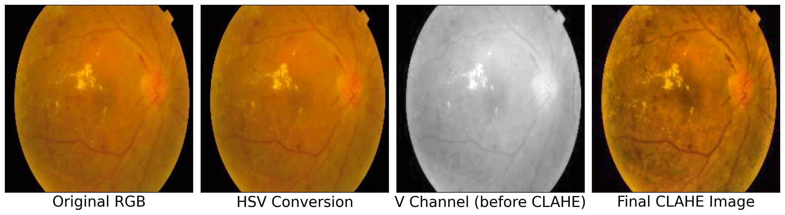 
  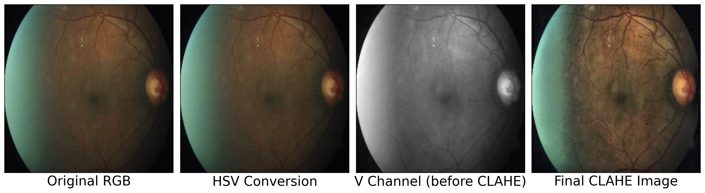

<i>Intermediate and final outputs of the fundus preprocessing pipeline.</i>

### 🌫️ Optical Coherence Tomography (OCT)
- Converted to grayscale (0–255 intensity).  
- Decomposed each pixel using the **Fibonacci representation** based on Zeckendorf’s theorem.  
- Generated **12 weighted binary planes** corresponding to Fibonacci numbers up to 233.  
- Used **6 fine-detail planes**, selecting the **4 with least noise** for final representation.  
- This preserves texture variations and reduces noise in OCT scans.

  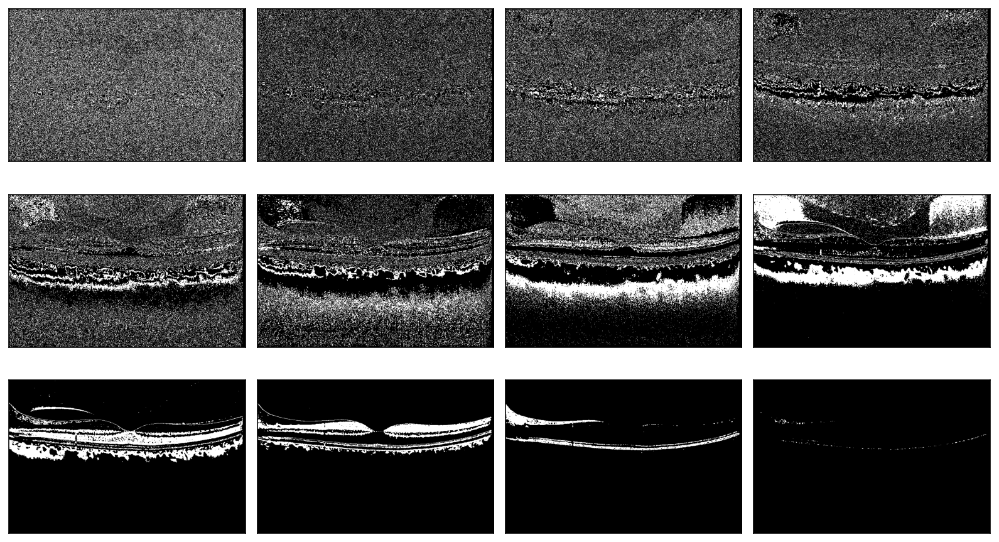 
  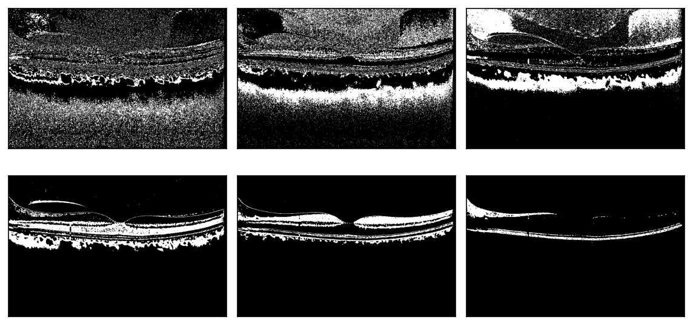 
  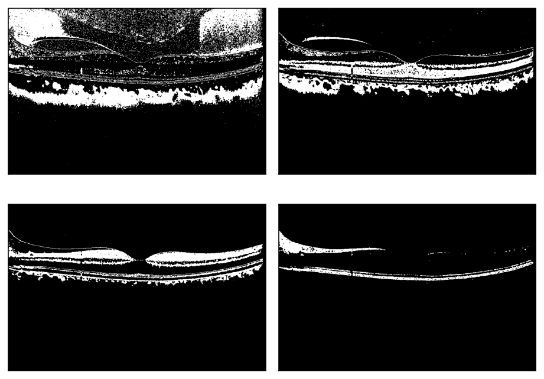

<i>Fibonacci-based binary plane decomposition of OCT images.</i>

---

## 🏗️ Model Architecture

### 🔹 FineFeatureCNN (OCT Stream)
A custom CNN designed for fine-grained OCT feature extraction.  
- No pooling layers to preserve spatial detail.  
- Series of convolutional + fully connected layers.  
- Feature map output: **512×8×8**, with **5.7M trainable parameters**.

  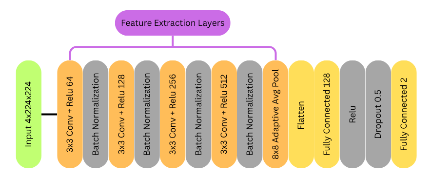

---

### 🔹 DASNet (Fundus Stream)
A **Dual Adaptive Subtle-Feature Network** for fundus classification.  
- Two parallel branches:  
  - Adaptive max pooling (fine features)  
  - Standard max pooling (coarse features)  
- Outputs concatenated and refined through convolutional layers.  
- Feature map output: **512×14×14**, with **413M trainable parameters**.

  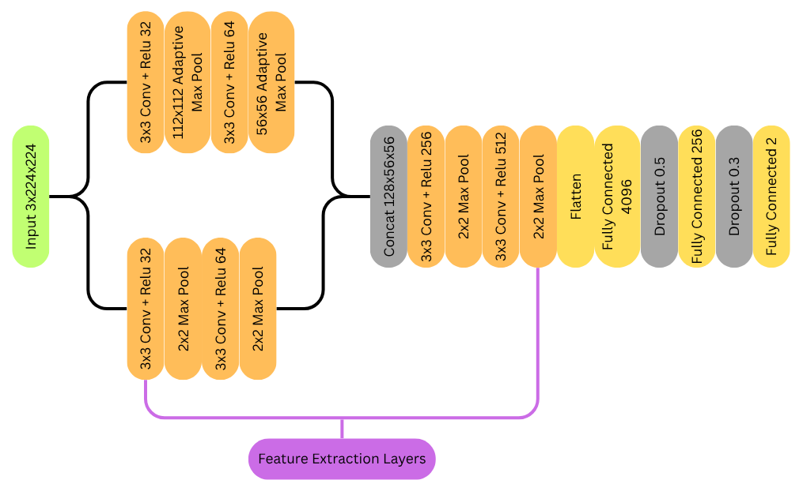

---

### 🔹 DualStreamNet (Fusion Network)
The multimodal fusion network combining features from both modalities.  
- Input: OCT (512×8×8) + Fundus (512×14×14).  
- Each stream compressed to **64×8×8** via adaptive pooling.  
- Flattened and concatenated to form an **8192-dimensional vector**.  
- Fully connected layers + dropout → final classification.  
- **40.3M trainable parameters**.

  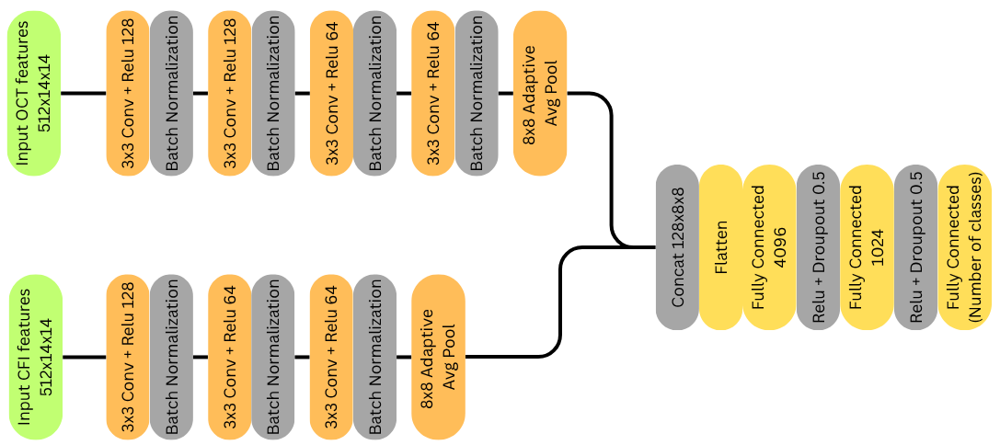

---

## 📊 Results

### 🧮 Binary Classification (Normal, DR)

| Class  | Precision | Recall | F1-Score | Support |
|:-------|:----------:|:-------:|:---------:|:--------:|
| Normal | 1.0000 | 0.9756 | 0.9877 | 82 |
| DR     | 0.9794 | 1.0000 | 0.9896 | 95 |
| **Accuracy** |  |  | **0.9887 (98.87%)** | 177 |

  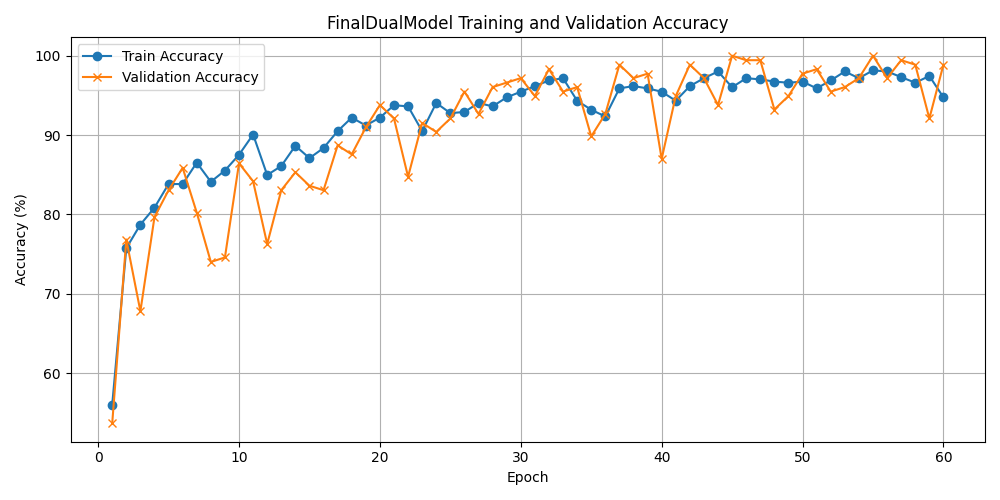 
  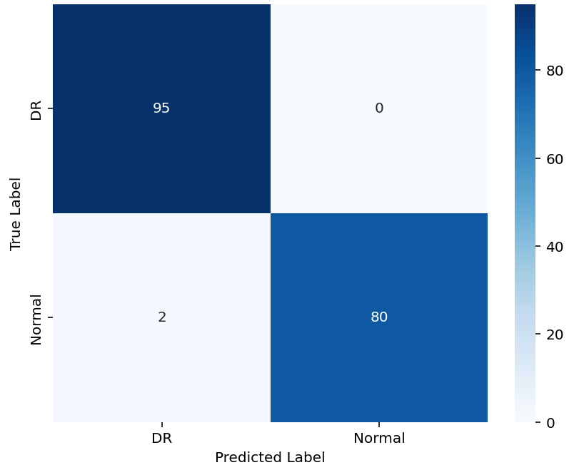

---

### 🧮 Three-Class Classification (Normal, NPDR, PDR)

| Class  | Precision | Recall | F1-Score | Support |
|:-------|:----------:|:-------:|:---------:|:--------:|
| Normal | 0.9688 | 0.9789 | 0.9738 | 95 |
| NPDR   | 1.0000 | 0.9474 | 0.9730 | 95 |
| PDR    | 0.9494 | 1.0000 | 0.9740 | 75 |
| **Accuracy** |  |  | **0.9745 (97.45%)** | 265 |

  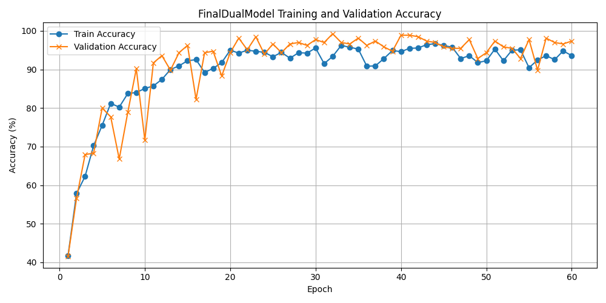 
  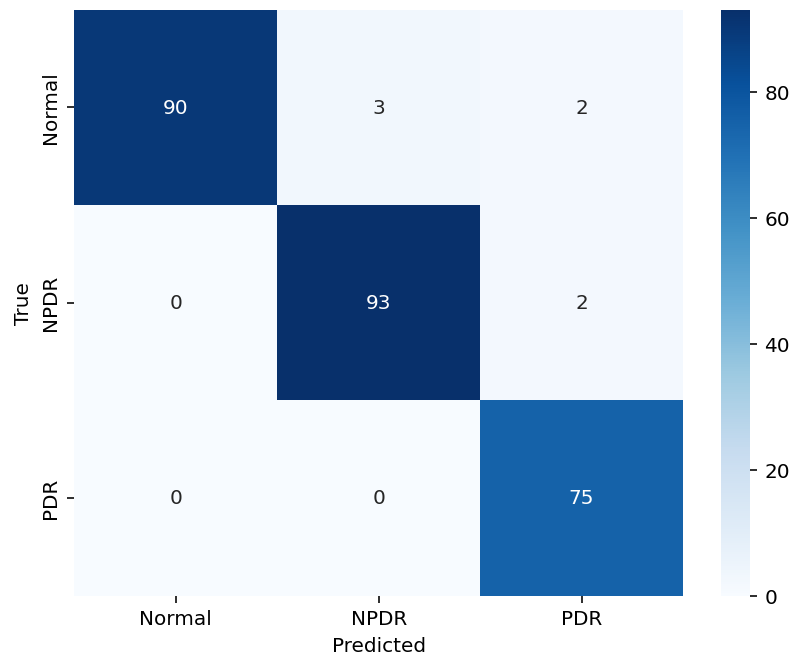

---

## 🧾 Summary

DualStreamNet effectively fuses **fundus** and **OCT** modalities to capture both **textural** and **structural** retinal details.  
It achieves:
- **98.87% accuracy** for binary DR classification  
- **97.45% accuracy** for three-class classification  

This multimodal design demonstrates strong generalization and potential for **clinical deployment** in diabetic retinopathy screening systems.

---
